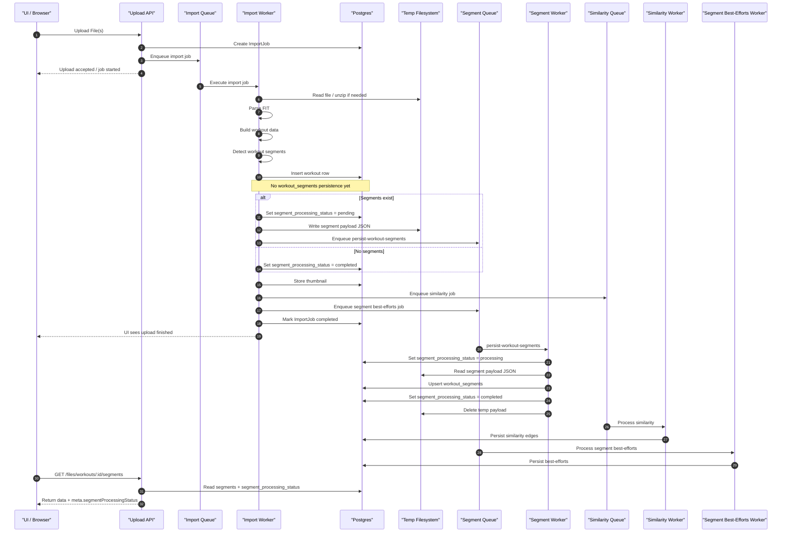

# Import Flow

```mermaid
sequenceDiagram
    autonumber
    participant UI as "UI / Browser"
    participant API as "Upload API"
    participant IQ as "Import Queue"
    participant IW as "Import Worker"
    participant DB as "Postgres"
    participant FS as "Temp Filesystem"
    participant SQ as "Segment Queue"
    participant SW as "Segment Worker"
    participant SIMQ as "Similarity Queue"
    participant SIMW as "Similarity Worker"
    participant BEW as "Segment Best-Efforts Worker"

    UI->>API: Upload File(s)
    API->>DB: Create ImportJob
    API->>IQ: Enqueue import job
    API-->>UI: Upload accepted / job started

    IQ->>IW: Execute import job
    IW->>FS: Read file / unzip if needed
    IW->>IW: Parse FIT
    IW->>IW: Build workout data
    IW->>IW: Detect workout segments
    IW->>DB: Insert workout row
    Note over IW,DB: No workout_segments persistence yet

    alt Segments exist
        IW->>DB: Set segment_processing_status = pending
        IW->>FS: Write segment payload JSON
        IW->>SQ: Enqueue persist-workout-segments
    else No segments
        IW->>DB: Set segment_processing_status = completed
    end

    IW->>DB: Store thumbnail
    IW->>SIMQ: Enqueue similarity job
    IW->>SQ: Enqueue segment best-efforts job
    IW->>DB: Mark ImportJob completed
    IW-->>UI: UI sees upload finished

    SQ->>SW: persist-workout-segments
    SW->>DB: Set segment_processing_status = processing
    SW->>FS: Read segment payload JSON
    SW->>DB: Upsert workout_segments
    SW->>DB: Set segment_processing_status = completed
    SW->>FS: Delete temp payload

    SIMQ->>SIMW: Process similarity
    SIMW->>DB: Persist similarity edges

    SQ->>BEW: Process segment best-efforts
    BEW->>DB: Persist best-efforts

    UI->>API: GET /files/workouts/:id/segments
    API->>DB: Read segments + segment_processing_status
    API-->>UI: Return data + meta.segmentProcessingStatus
```
